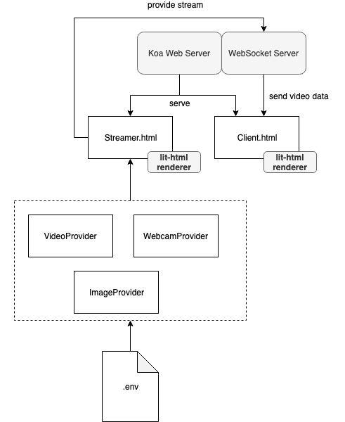

# momo-cam
Combined Node.js based streamer and client service for live-streaming our lovable Momo ❤️



## Installation

Install all the stuff

```sh
$ npm i
```

Set environment variables in local `.env` file to set correct [strategy](https://github.com/pinussilvestrus/momo-cam/tree/master/src/streamer/providers)

```json
VID_MEDIA_URL = 'http://...'
IMAGE_MEDIA_URL = 'http://...'
```


## Usage

```sh
$ npm run build
$ npm run start
```

Open http://localhost:4000/streamer.html to start streaming WebSocket and http://localhost:4000/client.html to view stream.

## Development

```sh
$ npm run dev
```